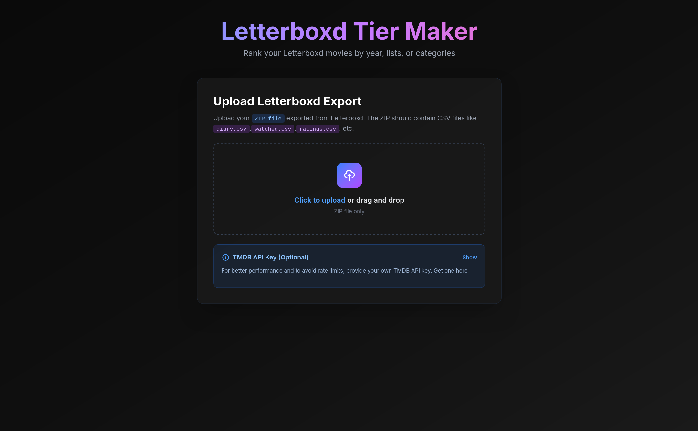
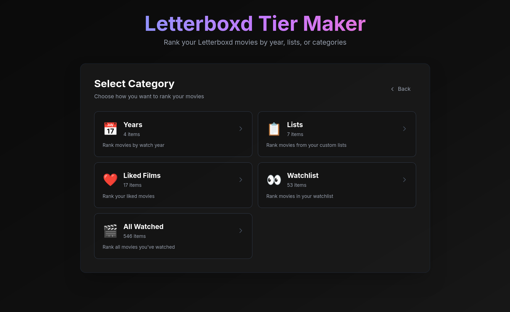
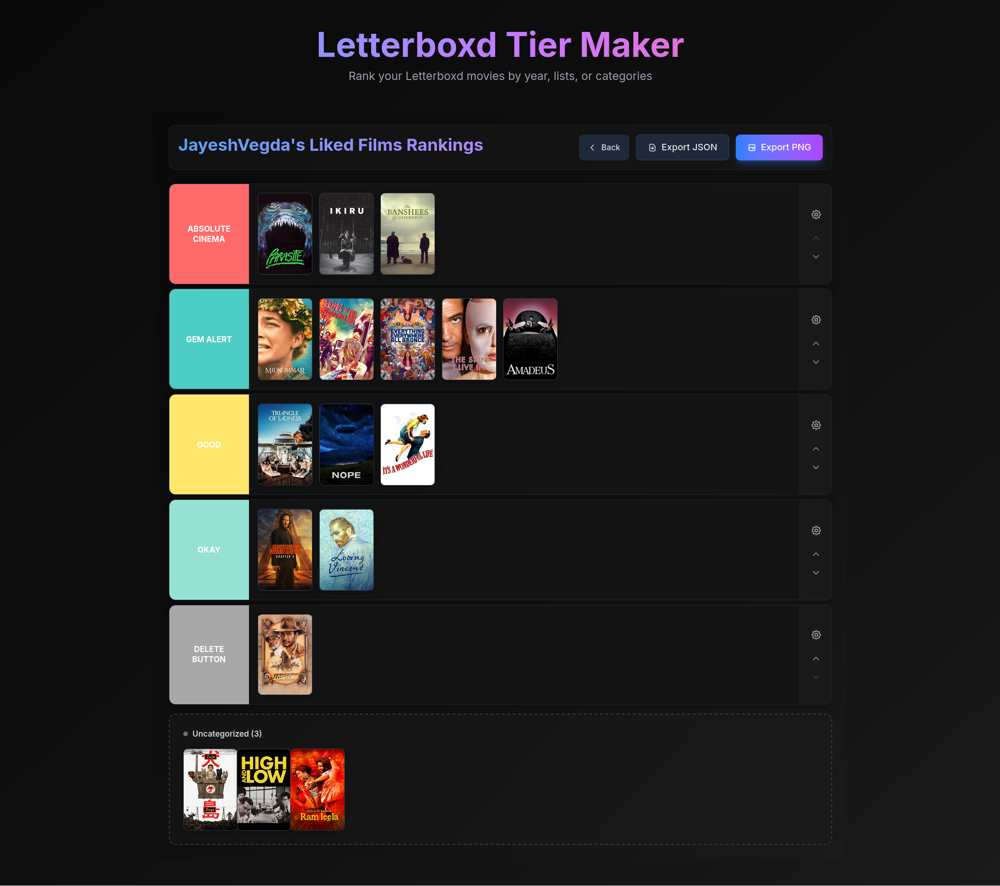

<div align="center">


# Letterboxd Tier Maker

Create beautiful tier lists from your Letterboxd movie data. Rank your watched films by year, lists, or categories with drag-and-drop functionality.

[](https://vercel.com/new/clone?repository-url=https://github.com/JayeshVegda/Letterboxd-Tier-Maker)

</div>

## 📸 Screenshots

<div align="center">

### Upload Your Letterboxd Export


### Select Category


### Create Your Tier List


</div>

## ✨ Features

- 📦 **Upload Letterboxd Export** - Upload your ZIP file exported from Letterboxd
- 🎬 **Multiple Categories** - Organize by years, lists, likes, watchlist, or all watched films
- 🖼️ **Auto Poster Fetching** - Automatically fetches movie posters from TMDB
- 🎯 **Drag & Drop** - Intuitive drag-and-drop interface for organizing movies
- 📊 **Custom Tiers** - Create and customize tier rows with colors and names
- 💾 **Export Options** - Export your tier list as PNG image or JSON file
- 📱 **Responsive Design** - Works perfectly on desktop and mobile devices

## 🚀 Quick Start

### Prerequisites

- Node.js 18.0.0 or higher
- npm 9.0.0 or higher
- A TMDB API key ([Get one here](https://www.themoviedb.org/settings/api))

### Installation

1. **Clone the repository**
   ```bash
   git clone https://github.com/JayeshVegda/Letterboxd-Tier-Maker.git
   cd Letterboxd-Tier-Maker
   ```

2. **Install dependencies**
   ```bash
   npm install
   ```

3. **Set up environment variables**
   
   Create a `.env.local` file in the root directory:
   ```env
   TMDB_API_KEY=your_tmdb_api_key_here
   NEXT_PUBLIC_SITE_URL=http://localhost:3000
   ```

4. **Run the development server**
   ```bash
   npm run dev
   ```

5. **Open your browser**
   
   Navigate to [http://localhost:3000](http://localhost:3000)

## 📖 How to Use

1. **Export from Letterboxd**
   - Go to your Letterboxd account settings
   - Export your data as a ZIP file
   - The ZIP should contain files like `diary.csv`, `watched.csv`, `lists/`, etc.

2. **Upload to Letterboxd Tier Maker**
   - Click "Upload Letterboxd Export"
   - Select your ZIP file
   - Wait for the upload to process

3. **Select a Category**
   - Choose from: Years, Lists, Likes, Watchlist, or All Watched
   - Select the specific year, list, or category you want to rank

4. **Create Your Tier List**
   - Drag movies from "Uncategorized" into tier rows
   - Reorder movies within tiers by dragging
   - Customize tier names and colors in settings

5. **Export Your Tier List**
   - Click "Export PNG" to save as an image
   - Click "Export JSON" to save the data

## 🛠️ Tech Stack

- **Next.js 16** - React framework
- **React 19** - UI library
- **Tailwind CSS** - Styling
- **@dnd-kit** - Drag and drop functionality
- **TMDB API** - Movie metadata and posters

## 📝 Environment Variables

| Variable | Required | Description |
|----------|----------|-------------|
| `TMDB_API_KEY` | Yes | Your TMDB API key for fetching movie data |
| `NEXT_PUBLIC_SITE_URL` | No | Your site URL (for metadata) |

## 🌐 Deployment

### Deploy to Vercel (Recommended)

1. Push your code to GitHub
2. Go to [vercel.com](https://vercel.com) and sign in with GitHub
3. Click "Add New Project" and import your repository
4. Add environment variables:
   - `TMDB_API_KEY` - Your TMDB API key
   - `NEXT_PUBLIC_SITE_URL` - Your Vercel URL (after first deploy)
5. Click "Deploy"

Your app will be live in minutes! 🎉

## 📂 Project Structure

```
letterbox_tiermaker/
├── app/
│   ├── api/           # API routes
│   ├── components/    # React components
│   ├── context/       # State management
│   └── page.jsx        # Main page
├── public/            # Static assets
└── scripts/          # Utility scripts
```

## 🤝 Contributing

Contributions are welcome! Feel free to open an issue or submit a pull request.

## 📄 License

MIT License - feel free to use this project for your own purposes.

## 🙏 Acknowledgments

- [Letterboxd](https://letterboxd.com) - For the amazing movie tracking platform
- [TMDB](https://www.themoviedb.org) - For movie metadata and posters
- [Next.js](https://nextjs.org) - For the amazing framework

---

<div align="center">

Made with ❤️ for movie lovers

[Report Bug](https://github.com/JayeshVegda/Letterboxd-Tier-Maker/issues) · [Request Feature](https://github.com/JayeshVegda/Letterboxd-Tier-Maker/issues)

</div>
